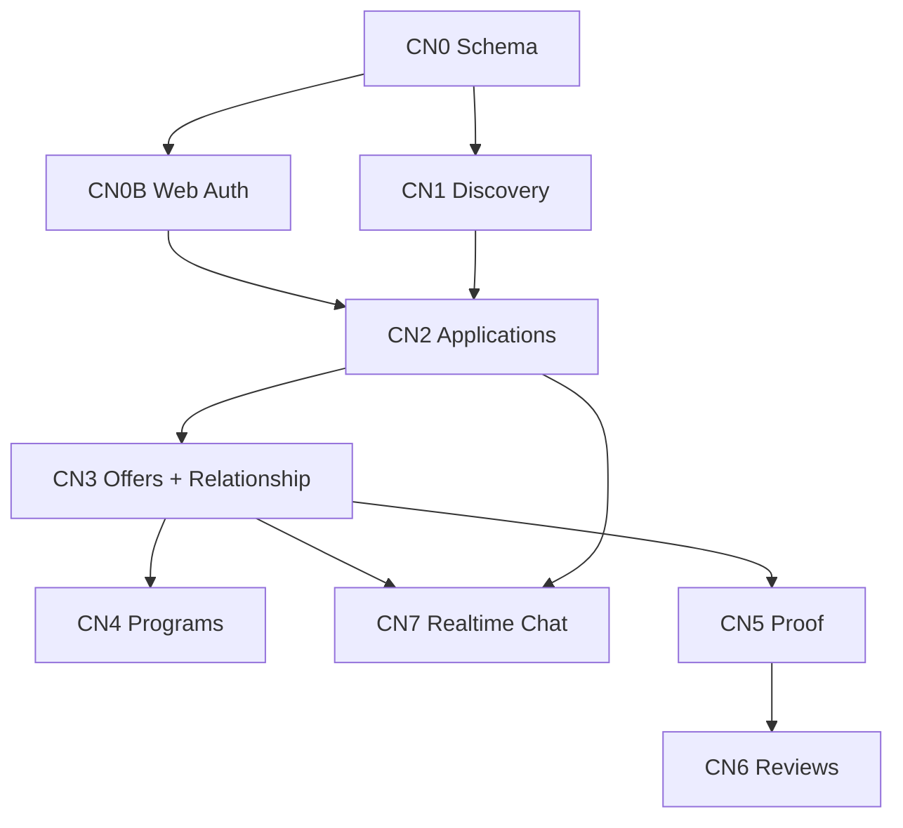

# Coach Network — Task Task Planlama

**Versiyon:** v1.1  
**Üst plan:** `docs/CoachNetworkPlan.md`  
**Güncelleme:** 2026-05-17  

---

## 0. Kilitlenen kararlar

| ID | Karar |
|----|--------|
| **K1** | Web mesajlaşma: **Supabase Realtime** (`postgres_changes` veya channel), basit thread modeli |
| **K2** | Sporcu kaydı **web’de** (Clerk register + athlete onboarding) |
| **K3** | Her antrenör = **kendi organization**; remote sporcu teklif kabulünde **o org’a** `athletes` olarak eklenir |
| **K4** | **Mevcut sistem bozulmaz:** org sahibi sporcu kadrosuna manuel/ davet ile sporcu eklemeye devam eder (coach-first, `user_id` boş olabilir) |
| **K5** | Tek Clerk uygulaması; web + app aynı `users` tablosu |
| **K6** | Public profil URL: `/coach-network/coaches/[slug]` |
| **K7** | MVP ödeme: manuel `payment_status` onayı (B1 billing ayrı track) |

---

## 1. İki sporcu yolu (bozulmayacak model)

```text
YOL A — Mevcut CoachOS (değişmez)
  Koç org'da athletes satırı oluşturur (user_id NULL olabilir)
  → davet linki → sporcu claim → athlete portal

YOL B — Marketplace (yeni)
  Sporcu web'de kayıt olur → athlete_marketplace_profiles
  → antrenöre başvuru → teklif → kabul
  → coach org'da athletes + user_id bağlı + remote_coaching_relationships

YOL C — Kesişim
  A'daki sporcu sonradan marketplace kullanmaz (opsiyonel link)
  B'deki sporcu zaten user_id ile gelir; kadro kaydı otomatik oluşur
```

**Şema notu:** `athletes.source` enum: `roster` | `marketplace` | `invite_claim` (migration’da).

---

## 2. Mesajlaşma (Supabase Realtime — basit)

### Mimari

```text
marketplace_conversations (thread)
  ├── type: application | offer | coaching | proof
  ├── context_id (application_id / offer_id / …)
  └── marketplace_conversation_participants (user_id, role)

marketplace_messages
  ├── conversation_id
  ├── sender_user_id
  ├── body (text)
  └── created_at

Client (web + app): supabase-js Realtime
  .channel(`conversation:${id}`)
  .on('postgres_changes', { event: 'INSERT', schema: 'public', table: 'marketplace_messages', filter: `conversation_id=eq.${id}` })
```

**Güvenlik (MVP):**

- Mesaj **insert** server action ile (admin client) + participant kontrolü.
- Realtime **subscribe** için: Supabase **anon key + RLS** (katılımcı sadece kendi thread’lerini okur) — Post-MVP Clerk JWT yerine bu yeterli.
- Alternatif basit: web’de subscribe, insert sadece server action (realtime sadece receive).

---

## 3. Task listesi — epik bazlı

Durum: `⬜` yapılacak | `◐` devam | `✅` bitti  

---

### EPIC CN0 — Altyapı ve şema

| ID | Task | Yüzey | Bağımlılık | Kabul kriteri |
|----|------|--------|------------|---------------|
| CN0-01 | `docs/supabase/012_coach_network.sql` enum’lar: application_status, offer_status, relationship_status, athlete_source | DB | — | Migration idempotent çalışır |
| CN0-02 | Tablo: `coach_marketplace_profiles` (slug unique, user_id, is_public, …) | DB | CN0-01 | CRUD type’ları hazır |
| CN0-03 | Tablo: `athlete_marketplace_profiles` (user_id unique) | DB | CN0-01 | Sporcu hedef/profil alanları |
| CN0-04 | Tablo: `coaching_packages` | DB | CN0-01 | Antrenör paket şablonu |
| CN0-05 | Tablo: `coach_network_applications` | DB | CN0-02,03 | status akışı |
| CN0-06 | Tablo: `coach_network_offers` | DB | CN0-05 | package snapshot JSON |
| CN0-07 | Tablo: `remote_coaching_relationships` | DB | CN0-06 | org_id, athlete_id, coach_user_id |
| CN0-08 | `athletes` kolon: `source` + `marketplace_user_id` (opsiyonel index) | DB | CN0-01 | Mevcut satırlar `roster` default |
| CN0-09 | Tablo: `marketplace_conversations` + `participants` + `messages` | DB | CN0-01 | Realtime publication açık |
| CN0-10 | RLS: messages/conversations — participant SELECT; INSERT via service role only veya participant INSERT policy | DB | CN0-09 | Anon client subscribe çalışır |
| CN0-11 | Storage bucket `coaching-proofs` (private) | DB | — | Signed URL policy |
| CN0-12 | `apps/app/lib/database.types.ts` güncelle | App | CN0-01–11 | tsc geçer |
| CN0-13 | `docs/supabase/README.md` 012 satırı | Docs | CN0-01 | Sıra dokümante |
| CN0-14 | Feature flag `NEXT_PUBLIC_COACH_NETWORK_ENABLED` web + app | Both | — | false iken route 404 |

---

### EPIC CN0B — Auth web + sporcu kayıt (K2)

| ID | Task | Yüzey | Bağımlılık | Kabul kriteri |
|----|------|--------|------------|---------------|
| CN0B-01 | `apps/web` Clerk paketi + `ClerkProvider` layout | Web | — | Build geçer |
| CN0B-02 | `apps/web/middleware.ts` — public vs protected routes | Web | CN0B-01 | /find-coach public |
| CN0B-03 | `/login` `/register` (Clerk components) | Web | CN0B-01 | Redirect after sign-in |
| CN0B-04 | Clerk Dashboard: web domain redirect URLs | Ops | CN0B-03 | Prod + local |
| CN0B-05 | Kayıt sonrası `publicMetadata.accountType`: `athlete` \| `coach` seçimi | Web | CN0B-03 | Metadata yazılır |
| CN0B-06 | `coach` → `getAppUrl('/onboarding')` yönlendirme | Web | CN0B-05 | Mevcut app onboarding |
| CN0B-07 | `athlete` → `/athlete/onboarding` (web) veya `/athlete/onboarding` app — **karar: web wizard** | Web | CN0B-05, CN0-03 | Profil + hedefler |
| CN0B-08 | Webhook `user.created`: `users` upsert (mevcut app webhook paylaşımı veya web API duplicate yok) | App | — | Tek webhook app’te kalır, web sadece client |
| CN0B-09 | `athlete_marketplace_profiles` oluştur (onboarding complete action) | Web | CN0-03, CN0B-07 | DB satırı |
| CN0B-10 | Navbar: giriş yapmış sporcu → “My applications” / “Messages” | Web | CN0B-03 | |

**Not:** Coach kayıt hâlâ app onboarding ile org oluşturur (K3). Sporcu org oluşturmaz.

---

### EPIC CN1 — Keşif ve public coach profil

| ID | Task | Yüzey | Bağımlılık | Kabul kriteri |
|----|------|--------|------------|---------------|
| CN1-01 | `lib/coach-network/public-queries.ts` — list coaches (filters) | Web | CN0-02 | SSR data |
| CN1-02 | Sayfa `/find-coach` — arama + filtre UI | Web | CN1-01 | 3+ demo profil listelenir |
| CN1-03 | Bileşen `CoachCard` | Web | CN1-01 | CTA: Profil / Apply |
| CN1-04 | Sayfa `/coach-network/coaches/[slug]` | Web | CN1-01 | Public read, SEO title |
| CN1-05 | App `/coach-network/profile` edit form | App | CN0-02 | Taslak kaydet |
| CN1-06 | Action `upsertCoachMarketplaceProfile` | App | CN1-05 | owner only |
| CN1-07 | `is_public` toggle + slug validate | App | CN1-06 | Yayında find-coach’da görünür |
| CN1-08 | Seed script veya SQL 3 demo coach profil | DB | CN1-07 | Demo |
| CN1-09 | Web navbar link “Find a coach” | Web | CN1-02 | |

---

### EPIC CN2 — Başvuru

| ID | Task | Yüzey | Bağımlılık | Kabul kriteri |
|----|------|--------|------------|---------------|
| CN2-01 | Web `/coach-network/apply/[coachProfileId]` — form (PRD §10.2) | Web | CN0B, CN1-04 | Auth required |
| CN2-02 | Consent checkboxes (veri paylaşımı PRD §8.4) | Web | CN2-01 | JSON snapshot |
| CN2-03 | Action `createCoachNetworkApplication` | Web | CN0-05 | status=sent |
| CN2-04 | Otomatik `marketplace_conversation` type=application | Web | CN0-09, CN2-03 | thread id application’a bağlı |
| CN2-05 | App `/coach-network/applications` liste | App | CN2-03 | org coach only |
| CN2-06 | App application detay sayfası | App | CN2-05 | sporcu özeti + paylaşılan alanlar |
| CN2-07 | Status geçişleri: viewed, rejected, request_info | App | CN2-06 | action + audit log |
| CN2-08 | Web `/athlete/applications` (veya `/coach-network/my-applications`) | Web | CN2-03 | sporcu kendi listesi |
| CN2-09 | AI başvuru özeti (Gemini, optional) | App | CN2-06 | kutu metin |

---

### EPIC CN3 — Teklif ve remote ilişki (K3, K4)

| ID | Task | Yüzey | Bağımlılık | Kabul kriteri |
|----|------|--------|------------|---------------|
| CN3-01 | App `/coach-network/packages` CRUD | App | CN0-04 | paket şablonları |
| CN3-02 | App offer compose UI (application’dan) | App | CN2-06, CN3-01 | draft → sent |
| CN3-03 | Action `sendCoachNetworkOffer` | App | CN3-02 | sporcu email notify (Resend opsiyonel) |
| CN3-04 | Conversation type=offer oluştur | App | CN3-03, CN0-09 | thread bağlı |
| CN3-05 | Web offer detay + Accept / Decline | Web | CN3-03 | auth sporcu |
| CN3-06 | Action `acceptCoachNetworkOffer` | Web/App | CN3-05 | transaction |
| CN3-07 | **Kabul akışı:** coach `organization_id` + default `team_id` altında `athletes` insert, `source=marketplace`, `user_id` sporcu | App | CN3-06, K4 | Mevcut roster akışı bozulmaz |
| CN3-08 | `remote_coaching_relationships` insert status=active | App | CN3-07 | |
| CN3-09 | `payment_status=pending_manual`; coach “Confirm payment” | App | CN3-08 | manuel onay |
| CN3-10 | App `/coach-network/remote-athletes` | App | CN3-08 | liste + filtre |
| CN3-11 | Workspace loaders: remote athlete’leri org scope’ta göster | App | CN3-07 | sessions/readiness çalışır |
| CN3-12 | **Regression test:** coach manuel athlete ekle (YOL A) hâlâ çalışır | App | — | invite + claim OK |

---

### EPIC CN4 — Program atama

| ID | Task | Yüzey | Bağımlılık | Kabul kriteri |
|----|------|--------|------------|---------------|
| CN4-01 | Tablo `coaching_program_assignments` veya `personal_trainings` genişletme | DB | CN3-08 | |
| CN4-02 | Coach: remote athlete’e program ata UI | App | CN4-01 | |
| CN4-03 | Athlete home: bugünkü program kartı | App | CN4-02 | |
| CN4-04 | Uyum % hesaplama (basit: tamamlanan gün / toplam) | App | CN4-02 | dashboard |

---

### EPIC CN5 — Proof

| ID | Task | Yüzey | Bağımlılık | Kabul kriteri |
|----|------|--------|------------|---------------|
| CN5-01 | Tablo `training_proofs` + storage upload action | App | CN0-11 | foto/video |
| CN5-02 | Athlete `/athlete/proofs` upload UI | App | CN5-01 | |
| CN5-03 | Coach proof review UI + status | App | CN5-01 | approve / needs_revision |
| CN5-04 | Proof thread → `marketplace_messages` veya proof-specific messages | Both | CN0-09 | feedback yazılır |
| CN5-05 | Adherence güncelleme on approve | App | CN5-03 | |

---

### EPIC CN6 — Değerlendirme ve reputation

| ID | Task | Yüzey | Bağımlılık | Kabul kriteri |
|----|------|--------|------------|---------------|
| CN6-01 | `coach_reviews` tablo + submit (relationship completed) | Web | CN3-08 | public profilde |
| CN6-02 | Coach private athlete rating (non-public) | App | CN3-10 | |
| CN6-03 | `coach_reputation_events` + basit skor | Both | CN6-01 | profil kartında |
| CN6-04 | Report review (basit flag) | Both | CN6-01 | |

---

### EPIC CN7 — Mesajlaşma Realtime (K1)

| ID | Task | Yüzey | Bağımlılık | Kabul kriteri |
|----|------|--------|------------|---------------|
| CN7-01 | Supabase Dashboard: `marketplace_messages` Realtime enabled | Ops | CN0-09 | |
| CN7-02 | `apps/web/lib/supabase-browser.ts` — anon client | Web | CN0-10 | env public keys |
| CN7-03 | Hook `useMarketplaceConversationRealtime(conversationId)` | Web | CN7-02 | yeni mesaj UI anında |
| CN7-04 | Web `/coach-network/messages` — thread listesi | Web | CN0-09 | katılımcı olduğu thread’ler |
| CN7-05 | Web `/coach-network/messages/[id]` — mesaj listesi + input | Web | CN7-03, CN7-04 | gönder + receive |
| CN7-06 | Server action `sendMarketplaceMessage` — participant check | Web | CN7-05 | insert |
| CN7-07 | App `/coach-network/messages` aynı hook (paylaşılan package `@repo/`?) | App | CN7-03 | coach tarafı |
| CN7-08 | Yeni mesaj badge (sidebar / navbar) | Both | CN7-04 | opsiyonel MVP+ |
| CN7-09 | Rate limit + max message length | Both | CN7-06 | abuse önleme |

**Basitlik notu:** İlk sürümde sadece **text** mesaj; dosya eki CN7+.

---

### EPIC CN8 — AI (Should Have)

| ID | Task | Yüzey | Bağımlılık | Kabul kriteri |
|----|------|--------|------------|---------------|
| CN8-01 | Find-coach “Recommended for you” (kural + Gemini) | Web | CN0B-09 | giriş yapmış sporcu |
| CN8-02 | AI feedback draft (coach, proof review) | App | CN5-03 | |

---

### EPIC CN9 — Deploy ve env

| ID | Task | Yüzey | Bağımlılık | Kabul kriteri |
|----|------|--------|------------|---------------|
| CN9-01 | Web Dokploy: Clerk env + Supabase anon | Ops | CN0B | |
| CN9-02 | App env değişmez (service role) | Ops | — | |
| CN9-03 | Realtime: Supabase proje ayarı prod’da açık | Ops | CN7-01 | |

---

## 4. Sprint önerisi (task sırası)

### Sprint 1 — Temel (CN0 + CN0B + CN1)

```text
CN0-01 → CN0-13 (şema)
CN0B-01 → CN0B-10 (web auth + sporcu kayıt)
CN1-01 → CN1-09 (keşif)
CN3-12 (regression YOL A — erken güvence)
```

### Sprint 2 — Başvuru + teklif (CN2 + CN3)

```text
CN2-01 → CN2-09
CN3-01 → CN3-11
```

### Sprint 3 — Realtime mesaj + program (CN7 + CN4)

```text
CN7-01 → CN7-09
CN4-01 → CN4-04
(CN2-04, CN3-04 conversation’lar mesajlaşmaya bağlanır)
```

### Sprint 4 — Proof + review (CN5 + CN6)

```text
CN5-01 → CN5-05
CN6-01 → CN6-04
```

### Sprint 5 — AI + polish (CN8 + CN9)

```text
CN8-01 → CN8-02
CN9-01 → CN9-03
```

---

## 5. Mevcut CoachOS task’leri (dokunma / regression)

Bu task’ler **Coach Network gelirken bozulmamalı** — her sprint sonu smoke:

| ID | Regression |
|----|------------|
| REG-01 | Coach onboarding → org + team + basic entitlement |
| REG-02 | Athletes sayfasından sporcu ekle (user_id boş) |
| REG-03 | Athlete invite link → claim → `/athlete/home` |
| REG-04 | Session + check-in sporcu self-service |
| REG-05 | Org switch çoklu org |
| REG-06 | Pro gate wearables / team memory |

---

## 6. Dosya / paket önerisi (monorepo)

```text
packages/coach-network/          # opsiyonel shared
  types/
  constants/
  realtime/useMarketplaceConversation.ts

apps/web/
  app/find-coach/
  app/coach-network/
  app/(auth)/login|register/
  app/athlete/onboarding/
  lib/supabase-browser.ts

apps/app/
  app/(protected)/coach-network/
  app/actions/coach-network.ts
  lib/coach-network/
```

---

## 7. Bağımlılık diyagramı (özet)



---

## 8. Tahmini efor (kabaca)

| Epik | Task sayısı | Tahmini |
|------|-------------|---------|
| CN0 | 14 | 3–4 gün |
| CN0B | 10 | 3–4 gün |
| CN1 | 9 | 3 gün |
| CN2 | 9 | 4 gün |
| CN3 | 12 | 5–6 gün |
| CN4 | 4 | 2–3 gün |
| CN5 | 5 | 4 gün |
| CN6 | 4 | 2 gün |
| CN7 | 9 | 4–5 gün |
| CN8–9 | 5 | 2 gün |
| **Toplam** | ~81 task | **~8–10 hafta** (1 dev), hackathon MVP: Sprint 1–2 |

**Hackathon MVP (2 hafta):** CN0, CN0B, CN1, CN2, CN3 (manuel payment), CN7 (text only), REG-* .

---

## 9. Sonraki aksiyon

1. CN0-01 migration taslağını onayla  
2. CN0B-01 web Clerk PR  
3. Paralel: REG checklist otomatikleştirme (Post-MVP E2E)

Bu dosya task tamamlandıkça `✅` ile güncellenir.
